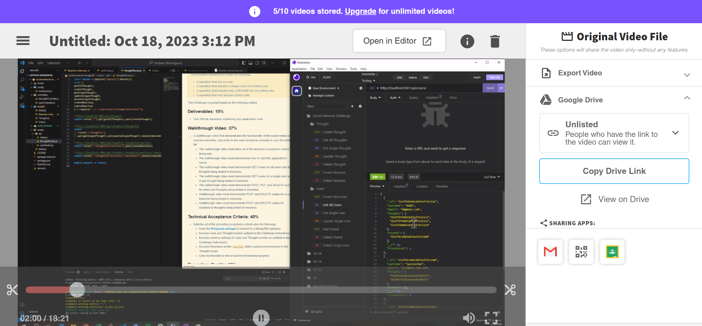

# social-network-mongoDB 

---
## Description
    
Back End application that allows for database manipulation through mongoDB, mongoose, compass

---    
## Table of Contents

+ **[Installation](#installation)**
+ **[Usage](#usage)**
+ **[License](#license)**
+ **[Contributing](#contributing)**
+ **[Tests](#tests)**

---  
## Installation
    
npm i
nodemon server.js

---    
## Usage
    
The reason behind the file is to display my ability to use mongoDB, mongoose, express.js, node.js, and async functions to build a back-end application allowing for database manipulation. 

---    
## License
    
MIT

---
## Contributing
    
UDenver Bootcamp

---
## Tests

none

---
## Questions

**Contact Me:**
Email: [nick.m.fillip@gmail.com](nick.m.fillip@gmail.com)
Cell: (281) 216 - 2183
Github Profile: [https://github.com/nfillip](https://github.com/nfillip)

---

    

## Website
Github Repo: [https://github.com/nfillip/social-network-mongoDB](https://github.com/nfillip/social-network-mongoDB) 
Video Walk-Through: [https://drive.google.com/file/d/1yY9jyB2bjPx1Plj6MgUx6EVPcYGOKyGP/view](https://drive.google.com/file/d/1yY9jyB2bjPx1Plj6MgUx6EVPcYGOKyGP/view)

---
© 2023 nfillip LLC. All Rights Reserved.